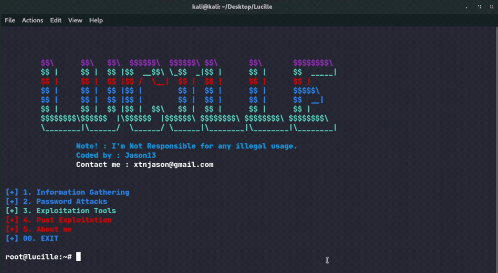

<h1 align="center">
  <a href="">
    <picture>
      <source height="125" media="(prefers-color-scheme: dark)" srcset="https://i.imgur.com/7Xc0YA6.png">
      
    </picture>
  </a>
  <br>
 
</h1>
<p align="center">
   a Python-based tool to streamline and centralize some pentesting tasks 
<p align="center">
  

</p>     

---

## About The Project
<b>Lucille</b> is a comprehensive web application security testing tool designed for cybersecurity professionals. built with <a href="https://www.python.org/">Python</a>, Lucille offers a suite of user-friendly tools, it aims to provide an efficient and practical tools streamlining pentesting tasks and centralizing various audit and exploitation techniques.

## ⚠️ **NOTE**

The previous version of Lucille has been fully removed. This is version 2, which includes more tools and fewer bugs. We recommend using this updated version for all your web application security testing needs. This new version offers enhanced functionality, improved stability, and a more efficient workflow 🚀 .


## 👀 Screenshots


<p float="left" align="middle">
  
  
</p>
<p float="left" align="middle">

  
    
</p>

## ⚙️ Installation


```bash
git clone https://github.com/yourusername/lucille.git
cd Lucille
pip install -r requirements.txt
```
To launch use : 

```bash
python lucille.py
or
python2 lucille.py
```

## 📖 Usage

Lucille provides a comprehensive set of tools for web application security testing:

1. Information Gathering:
- DNS Lookup + Cloudflare Detector
- Whois Lookup
- Zone Transfer
- Reverse IP Lookup
- Linkgrabber

2. Password Attacks:
- WordPress Brute Force
- Joomla Brute Force
- CPanel Brute Force
- Mass Brute Force + CMS Filter

3. Exploitation Tools:
- Admin Panel Finder
- MD5 Decryptor

4. Post-Exploitation Tools:
- Shell Checker
- SMTP Tester
- Mail List From Config

To use a specific tool:

1. Launch Lucille from the command line.
2. Select the desired tool from the main menu.
3. Follow the on-screen prompts to input the required information.
4. Review the results provided by the tool.

## ⭐️ Show Your Support

If you find Lucille helpful or interesting, please consider giving us a star on GitHub. Your support helps promote the project and lets others know that it's worth checking out. 

Thank you for your support! 🌟